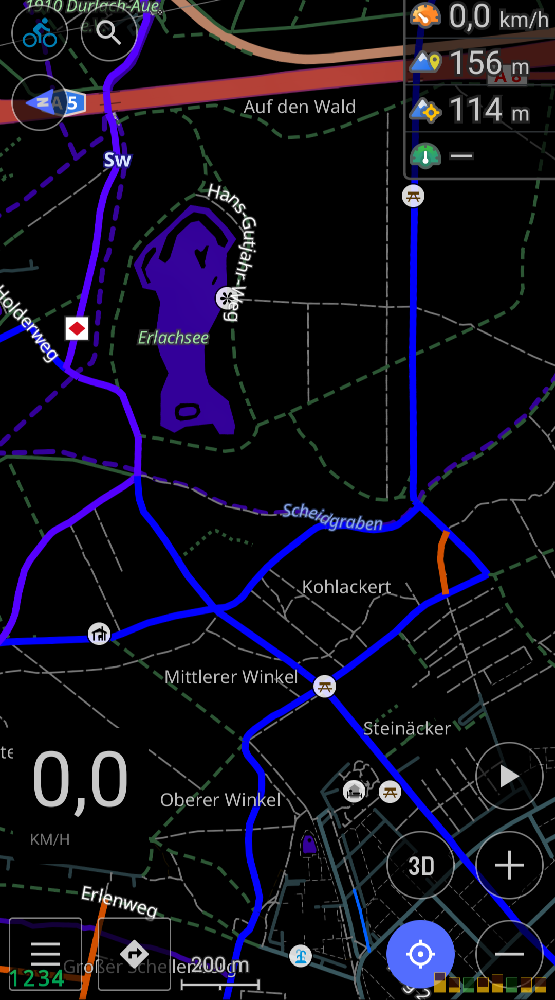

# CycloRoute black

These values are set differently than the original.
  <renderingConstant name="defaultColorNight" value="#000000"/>
  <renderingConstant name="shaderColorNight" value="#000000"/>
  <renderingConstant name="builtUpAreasColorNight" value="#000000"/>

Download CycloRoute.render.xml and open with Osmand to import (should appear automatically as an option).

To enjoy full blackness, tick "Hide Areas" option 
Reduced my battery use on an OLED phone by a few percent compared to the normal Cylosm night theme.

 
   

Thanks to the CycloRoute Team :)
